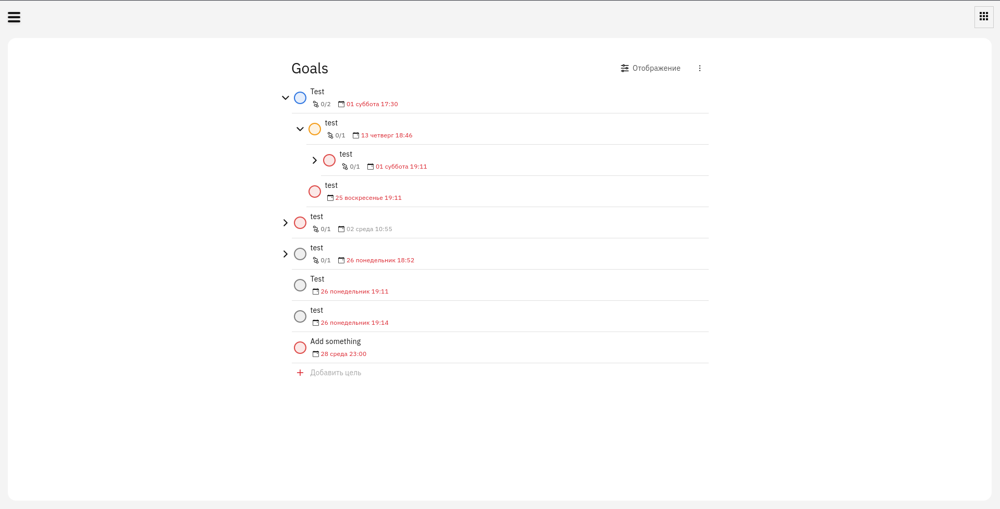
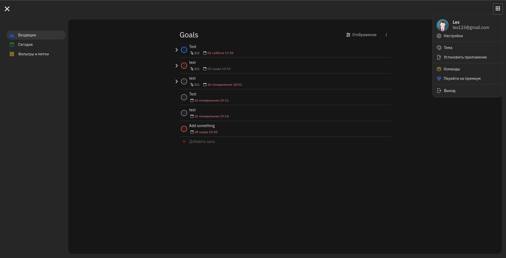
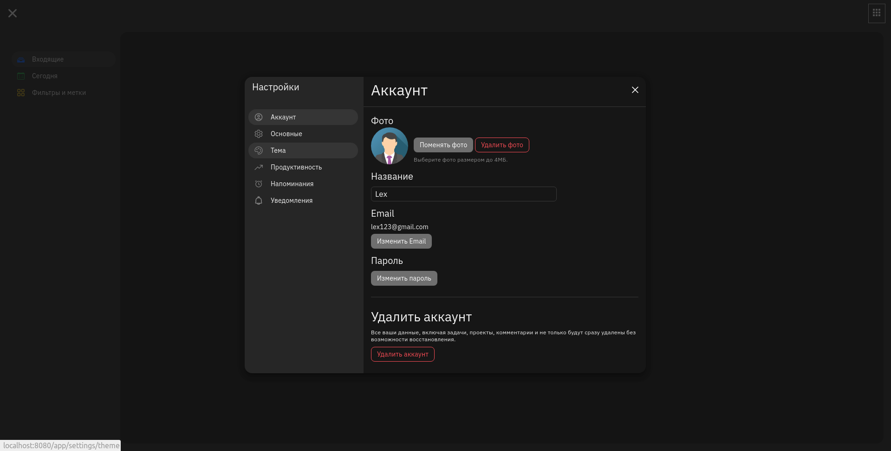
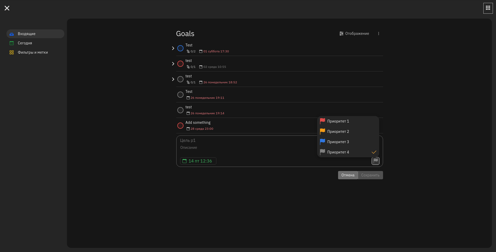
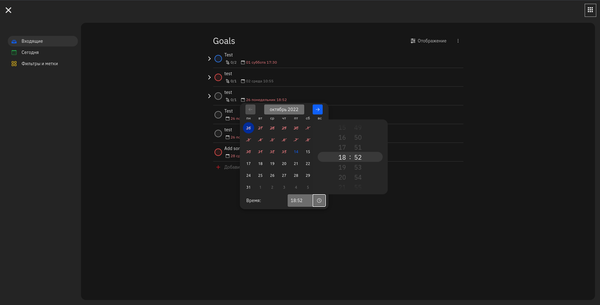

# AchieveGoals

Простой таск-трекер с возможностью установки дедлайнов и просмотром прогрессов. Главной целью давнного проекта была разработка простого таск-трекера с
возможностью введения нескольких проектов и оценки их прогресса. 

Планы на будущее:
- Добавление меток.
- Объединение задач в проекты.
- Создание командных проектов.

Используемые технологии:
- Kotlin
- Spring
- Svelte
- S3 Minio
- PostgreSQL

### Screenshots
Т.к проект учебный, дизайн был скопирован с сервиса [Todoist](https://todoist.com/).

* Главная страница (светлая тема)

* Главная страница (темная тема, с боковой панелью)

* Страница настроек (светлая тема)

* Создание новой задачи

* Изменение даты dedline'а
